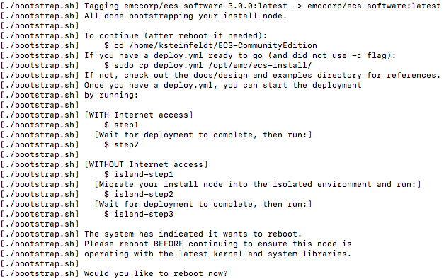

# ECS Community Edition Installation

ECS Community Edition now features a brand new installer. This installer aims to greatly improve user experience through automation. This document will guide the user through the new installation process.

## Prerequisites

Listed below are all necessary components for a successful ECS Community Edition installation. If they are not met the installation will likely fail.

### Hardware Requirements

The installation process is designed to be done from a dedicated installation node. This node will bootstrap the ECS instance and, when the process is complete, can be destroyed. Both single node and multi-node require only a single installation node. The technical requirements for this machine are minimal, but will affect the speed of the installation process. We recommend the following:

* 2 Cores
* 4 GB Memory
* 10GB HDD
* CentOS 7 Minimal

The minimum technical requirements for the target node is as follows:
 
* 4 Cores
* 16 GB Memory
* 100 GB block storage unit (raw, unpartitioned)
* CentOS 7 Minimal

For multi-node installations each data node must fulfill these minimum qualifications. The installer will do a pre-flight check to ensure that the minimum qualifications are met. If they are not the installation will not continue. 

### Environmental Requirements

The following environment is required to ensure a successful installation. 

* **Network:** Currently, all nodes, installation and target, must exist on the same subnet.
* **SSH:** Installation is coordinated via SSH, however, key authentication is not yet supported and password authentication must be enabled.
* **OS:** Centos7 Minimal

### Additional Information

A single node *can* successfully run the installation procedure on itself. To do this simply input the node's own IP address as the installation node as well as the data node in the deploy.yml file.

## Getting Started

Before the data nodes can be created we have to prepare the installation node. If downloading the repository from github run `sudo yum install git -y` to install git and then `git clone [insert repo address here]`. If the repository is being added to the machine via usb drive, scp, etc. run:

* for .zip archive `unzip ECS-CommunityEdition.zip`
* for .tar.gz archive `tar -xzvf ECS-CommunityEdition.tar.gz`

Once the archive has been expanded the installation node must be bootstrapped. To do this `cd` into the ECS-CommunityEdition directory and run `./bootstrap.sh`. 

After the installation node has successfully finished you may be prompted to reboot the machine. If this is the case the machine must be rebooted before continuing.

## The YML File

Installation requires the creation of a YML configuration file called deploy.yml. This file ***must*** be written before moving on. Create this file in `/opt/emc/ecs-install`. A template guide for writing this file can be found [here](deploy.yml.rst). 

To quickly create a template, simply: 

* run `sudo cp ~/ECS-CommunityEdition/docs/design/reference.deploy.yml /opt/emc/ecs-install/` 
* rename the file with `sudo mv /opt/emc/ecs-install/reference.deploy.yml /opt/emc/ecs-install/deploy.yml`
* then edit the file with `sudo vim /opt/emc/ecs-install/deploy.yml` ***be sure to use `sudo` or the file will be opened as readonly and any changes made will not be written***

*note: If you find that you've edited the file without sudo privileges, the command `:w !sudo tee %` can be used to write the while in vim*

### deploy.yml Basics

These steps quickly set up a basic deploy.yml file

1) Set `license_accepted` field to `true`
2) Enter the IP address of the **installation node** into the `install_node` field
3) Enter CIDR address(es) of any machines authorized that will communicate with the ECS management API into the `management_clients` field. `0.0.0.0/0` Allows total access. *Note*: this may be be a block of addresses or subnet.
4) Hostnames may be auto-named with the `autonaming` field. `moons` or `cities` are options.
5) Credential configuration: usernames and credentials for node access. This must be the same across all nodes
6) Enter your DNS server address into `dns_servers`. This can be found with `cat /etc/resolv.conf`
7) Enter NTP server address into `ntp_servers`. This will likely be the same value as `dns_servers`
7) List block devices in `ecs_block_devices`. *Note*: Do not include `/dev/` only `sdb`, `sdc`, etc. Block devices can be seen by running `lsblk` 
8) Enter data node address(es) in Storage Pool `members`
1) Enter block devices again under Storage Pool `members`

***Please read the reference deploy.yml found [here](). It is designed to be self documenting and required fields are filled with either dummy or default values. The above values are only bare minimum values and may not yield the desired result.***

## Step1

Once the deploy.yml file has been correctly written the next step is to simply run `step1`

## Step2

Once step1 has completed run `step2`

