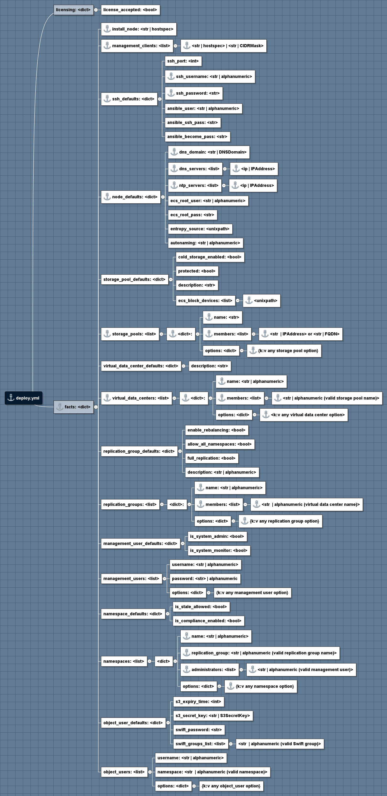

deploy.yml
==========

The installer works off a configuration file called ``deploy.yml``
placed in ``/opt/emc/ecs-install``.

deploy.yml Reference Diagram
----------------------------

The following is a visual overview of the deployment configuration file

   Reference Diagram

deploy.yml Template
-------------------

The following deploy.yml reference template can be found in
``docs/design/reference.deploy.yml`` in the ECS-CommunityEdition
repository on Github.

::

    # deploy.yml reference implementation

    # [Optional]
    # By changing the license_accepted boolean value to "true" you are
    # declaring your agreement to the terms of the license agreement
    # contained in the license.txt file included with this software
    # distribution.
    licensing:
      license_accepted: false

    # [Required]
    # Deployment facts reference
    facts:

      # [Required]
      # Node IP or resolvable hostname from which installations will be launched
      # The only supported configuration is to install from the same node as the
      # bootstrap.sh script is run.
      # NOTE: if the install node is to be migrated into an island environment,
      #       the hostname or IP address listed here should be the one in the
      #       island environment.
      install_node: 192.168.2.200

      # [Required]
      # IPs of machines that will be whitelisted in the firewall and allowed
      # to access management ports of all nodes. If a member of this list is set to
      # the wildcard mask (0.0.0.0/0) then anyone can access management ports!
      management_clients:
        - 0.0.0.0/0

      # [Required]
      # These credentials must be the same across all nodes. Ansible uses these
      # credentials to gain initial access to each node in the deployment and set
      # up ssh public key authentication. If these are not correct, the deployment
      # will fail.
      ssh_defaults:
        # Username to login as
        ssh_username: admin
        # Password to use with SSH login
        ssh_password: ChangeMe

      # [Required]
      # Environment configuration for this deployment.
      node_defaults:
        dns_domain: local
        dns_servers:
          - 192.168.2.2
        ntp_servers:
          - 192.168.2.2
        #
        # [Optional]
        # VFS path to source of randomness
        # Defaults to /dev/urandom for speed considerations.  If you prefer
        # /dev/random, put that here.
        # If you have a /dev/srandom implementation or special entropy hardware,
        # you may use that too so long as it implements a /dev/random type device
        # abstraction.
        entropy_source: /dev/urandom
        #
        # [Optional]
        # Picklist for node names.
        # Available options:
        # - "moons" (ECS CE default)
        # - "cities" (ECS SKU-flavored)
        autonaming: moons

      # [Optional]
      # Storage pool defaults. Configure to your liking.
      # All block devices that will be consumed by ECS on ALL nodes must be listed
      # under the ecs_block_devices option. This can be overridden by the storage
      # pool configuration. At least ONE (1) block device is REQUIRED for a
      # successful install. More is typically better.
      storage_pool_defaults:
        is_cold_storage_enabled: false
        is_protected: false
        description: Default storage pool description
        ecs_block_devices:
          - /dev/vda

      # [Required]
      # Storage pool layout. You MUST have at least ONE (1) storage pool for a
      # successful install.
      storage_pools:
        - name: sp1
          members:
            - 192.168.2.220
            - 192.168.2.221
            - 192.168.2.222
            - 192.168.2.223
          options:
            is_protected: false
            is_cold_storage_enabled: false
            description: My First SP
            ecs_block_devices:
              - /dev/vda

      # [Optional]
      # VDC defaults. Configure to your liking.
      virtual_data_center_defaults:
        description: Default virtual data center description

      # [Required]
      # Virtual data center layout. You MUST have at least ONE (1) VDC for a
      # successful install. WARNING: Multi-VDC deployments are not yet implemented.
      virtual_data_centers:
        - name: vdc1
          members:
            - sp1
          options:
            description: My First VDC

      # [Optional]
      # Replication group defaults. Configure to your liking.
      replication_group_defaults:
        description: Default replication group description
        enable_rebalancing: true
        allow_all_namespaces: true
        is_full_rep: false

      # [Optional, required for namespaces]
      # Replication group layout. At least one replication_group is required to also
      # provision namespaces.
      replication_groups:
        - name: rg1
          members:
            - vdc1
          options:
            description: My First RG
            enable_rebalancing: true
            allow_all_namespaces: true
            is_full_rep: false

      # [Optional]
      # Namespace defaults.
      namespace_defaults:
        is_stale_allowed: false
        is_compliance_enabled: false

      # [Optional]
      # Namespace layout
      namespaces:
        - name: ns1
          replication_group: rg1
          administrators:
            - root
          options:
            is_stale_allowed: false
            is_compliance_enabled: false

