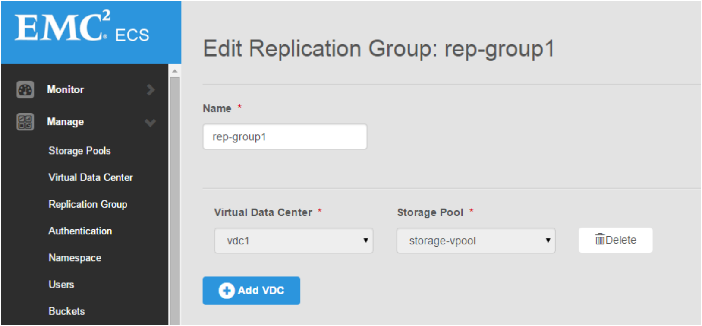
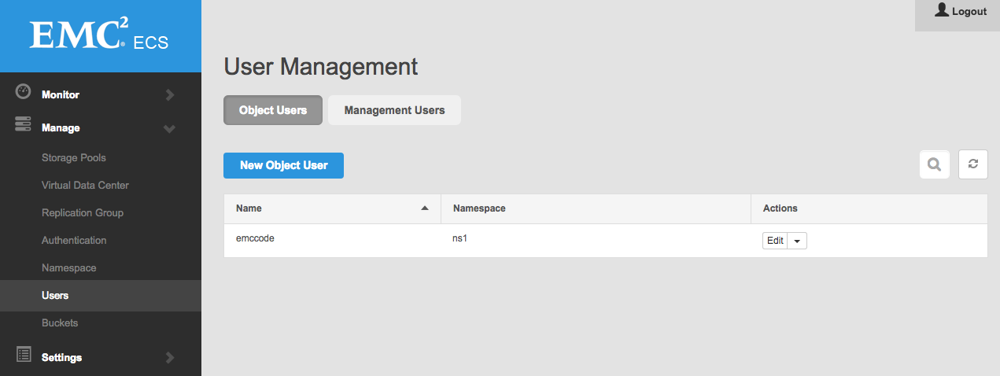

ECS Administrative Web UI
=========================

Login to the Web UI
-------------------

The WebUI uses SSL and a self-signed certificate to help protect your
session from casual eves-dropping. Take the IP of your first ECS node,
fire up your browser, and point ``https://`` at it. For this example,
the latest Google Chrome browser was used.

You cannot add, change, or remove administrative users in this build.
Use the default below.

    Username: **root**\ Password: **ChangeMe**

Input License
-------------

Open *Settings*, then *Licensing* and upload the ``license.xml`` file
located in the ecs-single-node / ecs-multi-node folder. **The UI will
not automatically update the license view in this release.** Navigating
away from page and returning will prompt it to update. You may need to
try a few times before it updates. Once it does, you should see
something like this:

.. figure:: ../media/input_license.PNG
   :alt: Upload License file

   Upload License file

Create Storage vPool
--------------------

Open *Manage*, then *Storage Pools* and create a storage pool. Keep the
name simple, and add all nodes to the pool. Click *Save*.

There's a known issue in this build that causes the Storage Pools view
to appear frozen for about 1-2 minutes after provisioning begins.
**Unlike with the license view case, this view will update on its own.**
Once it's updated, you should see something similar to:

.. figure:: ../media/create_storage_vpool.PNG
   :alt: Create Storage VPool

   Create Storage VPool

Create Virtual Data Center
--------------------------

Open *Manage*, then *Virtual Data Center* and create a Virtual Data
Center using the below screenshot as a guide. **Please wait for up to 20
minutes after creating a Storage vPool before creating a Virtual Data
Center.** There are several background tasks that must complete, and for
object to fully initialize.

.. figure:: ../media/create_virtual_data_center.PNG
   :alt: Create Virtual Data Center

   Create Virtual Data Center

Create Replication Group
------------------------

Open *Manage*, then *Replication Group* and create a Replication Group
using the below as an example. Currently only one VDC in a replication
group is supported.

   Create Replication Group

Create Namespace
----------------

Open *Manage*, then *Namespace*. Set up a Simple Namespace with a name
such as "ns". Input a namespace username to use with the namespace, such
as "ecs\_user". Select the replication group for the namespace, and
click *Save* at the very bottom.

Namespace features available in this release
                                            

-  ✔ Simple Namespace
-  

   .. raw:: html

      <del>

   Retention Policies

   .. raw:: html

      </del>

-  

   .. raw:: html

      <del>

   Quotas

   .. raw:: html

      </del>

-  

   .. raw:: html

      <del>

   Authentication Domains

   .. raw:: html

      </del>

.. figure:: ../media/create_namespace.PNG
   :alt: Create Namespace

   Create Namespace

Create Object User Account
--------------------------

Open *Manage*, then *Users*, then click on *Object Users* and *New
Object User* to set up object store credentials.

   Create Namespace

Create secrets by filling the fields and clicking the buttons.

-  S3 Key: Click *Generate & Add Password* to retrieve the
   server-generated key.
-  Swift Password: Enter your own password and click *Set Password*.

.. figure:: ../media/create_object_user_keys.png
   :alt: Create User S3 and Swift Keys

   Create User S3 and Swift Keys
