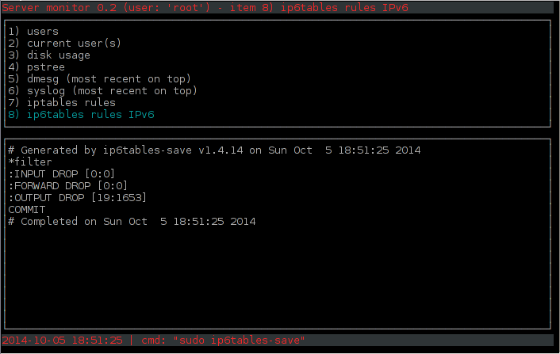

pyservmonitor
=============

Pyservmonitor is a simple python urwid interface to your one-liner scripts.

the different entries in the interface are easily editable (in [config.ini](config.ini))

Available one-liners:

* docker (using local library)
* apache/nginx
* fail2ban
* portspoof
* ...

examples/pyservmonitor.png

